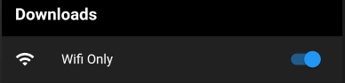
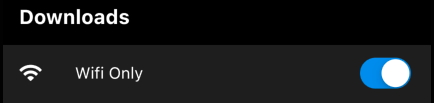
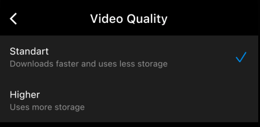

# Netflix - App Settings - UI Adaptative

Esse projeto tem como objetivo apresentar técnicas para personalização do app de acordo com a plataforma (Android e iOS).

## Navegação Personalizada

Para realizar a navegação padrão de cada guideline (Material e Cupertino), podemos utilizar o MaterialPageRoute e o CupertinoPageRoute.

```dart
onTap: defaultTargetPlatform == TargetPlatform.android
                    ? () => Navigator.push(
                          context,
                          MaterialPageRoute(
                              builder: (final _) => const VideoQualityPage()),
                        )
                    : () => Navigator.push(
                          context,
                          CupertinoPageRoute(
                              builder: (final _) => const VideoQualityPage()),
                        ),
```

### Exemplo


## Widgets Adaptive

Alguns widgets possuem o contrutor adaptive, que automaticamente ajustam a sua apresentação conforme a plataforma.

```dart
Icon(Icons.adaptive.arrow_back)
```

```dart
Switch.adaptive(activeColor: Colors.blue,
                value: true,
                onChanged: (bool value) {}),
```

### Exemplo

 



## Ícones Personalizados

Ao criar um projeto Flutter, a dependência cupertino_icons é adicionada automaticamente. Com ela podemos apresentar o icone correspondente a plataforma.

```dart
defaultTargetPlatform == TargetPlatform.android
                ? const Icon(
                    Icons.check,
                    color: Colors.blue,
                  )
                : const Icon(
                    CupertinoIcons.check_mark,
                    color: Colors.blue,
                  ),
```

### Exemplo


